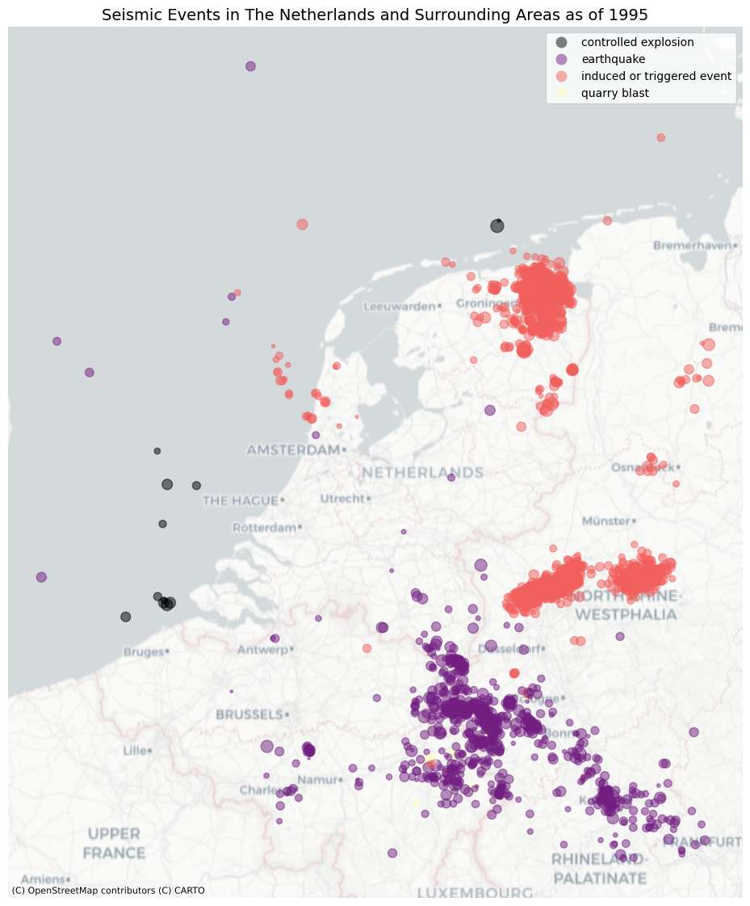
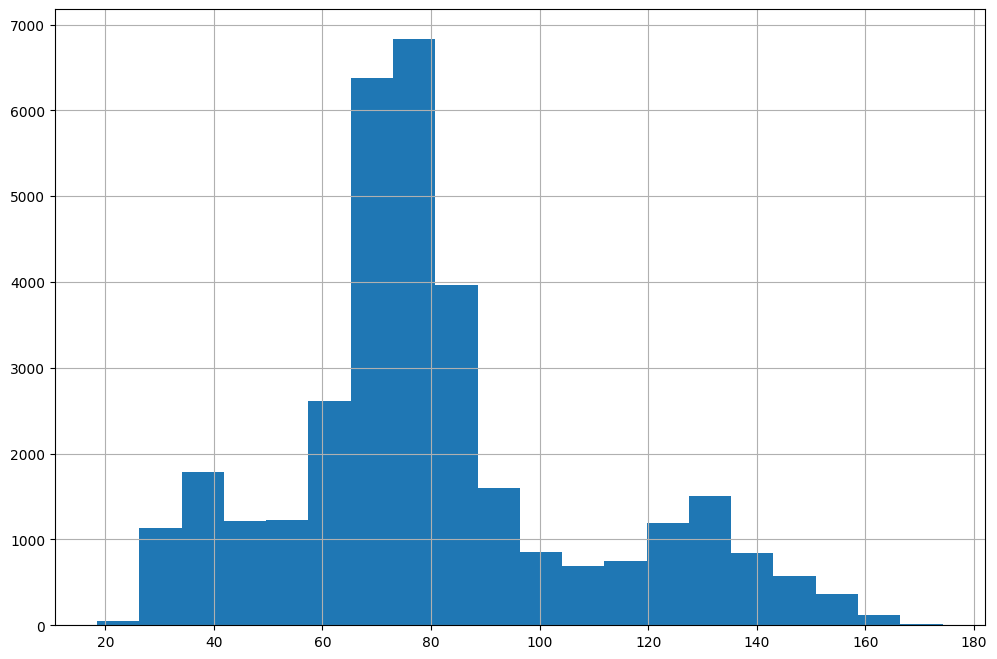
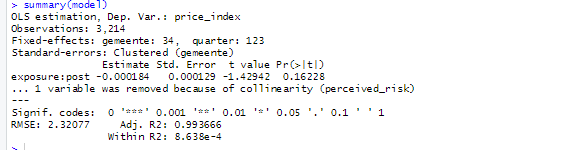
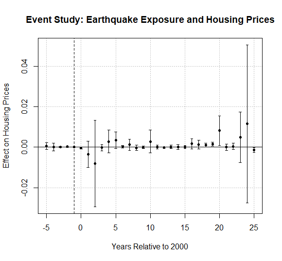

# Earthquakes and House Prices in Groningen

## The Question

The case asks a causal question: **what is the effect of earthquakes on house prices?**

That question matters because Groningen has experienced induced earthquakes linked to gas extraction. These events create physical damage risk, safety concerns, and a broader perception that a house in the area may be less attractive or more costly to own. A simple correlation between earthquakes and prices is not enough: the assignment asks whether seismic exposure itself changes house prices.

The working comparison is regional. Municipalities in Groningen are compared with municipalities in Friesland and Drenthe. The intended pre-period is before significant seismic activity, with a post-period from 2000 onward.

## Data Engineering

The `src/` pipeline builds the analysis panel from three moving parts:

- CBS house-price index data: `Prijsindex Bestaande Koopwoningen PBK`, measured by municipality and quarter.
- CBS administrative boundaries: municipality and province geometries for each year from 1995 onward.
- KNMI seismic events: earthquake records from the KNMI FDSN API, filtered to remove preliminary records and non-earthquake events such as explosions.

The engineering challenge is that this is not just a table join. Municipal boundaries can change over time, and earthquake exposure is spatial. The project therefore creates two processed geospatial datasets:

- `data/processed/gdf_area_prijs.parquet`: municipality-year geometries joined to quarterly house-price indices and province labels.
- `data/processed/gdf_aardbevingen.parquet`: cleaned earthquake events with timestamps, locations, magnitudes, depths, and geometries.

The implementation in `src/house_price_causality/build_dataset.py` and `src/house_price_causality/utils.py` does the core work: parse CBS periods into year/quarter/date fields, harmonize yearly CBS geometries, spatially join municipalities to provinces, collect KNMI events, filter events, and write Parquet files for the analysis scripts.

## What The Data Shows

The notebook first explores the spatial distribution of seismic events. The cluster around Groningen is visible and distinct from many natural events elsewhere in the Netherlands and surrounding regions.



The municipal house-price index has wide variation over the full panel, which matters for modeling: the outcome is not a rare or static measure, and time fixed effects are needed to absorb broad national housing-market movement.



## Experimental Design

The chosen design is a spatial difference-in-differences prototype. Instead of a binary treatment such as "Groningen after 2000", the analysis constructs a continuous exposure measure. Each municipality-quarter receives exposure from earthquakes in that same quarter, weighted by earthquake strength and distance.

The exposure formula in the R analysis is:

```text
exposure_it = sum over earthquakes e in quarter t:
              [10^(1.5 * magnitude_e) / (1 + depth_e)] * exp(-lambda * distance_ie)
```

This means larger magnitudes matter more, deeper events matter less, and distant events decay exponentially. Distances are computed from municipality boundaries rather than centroids after transforming the spatial data to EPSG:3035.

Several alternatives remain plausible: a binary treatment, a single-event study around the 2012 Huizinge earthquake, a staggered design with `sunab()`, cumulative exposure, lagged exposure, or a design based on damage claims. The current version favors a simple, interpretable continuous exposure.

## DAG And Assumptions

The causal story is:

```text
Seismic activity -> damage/risk perception -> house prices
Location characteristics -> seismic activity
Location characteristics -> house prices
Time shocks -> house prices
```

The model uses municipality fixed effects to absorb stable differences across municipalities and quarter fixed effects to absorb shared housing-market shocks. The main identification assumption is that, after these controls, the timing and intensity of exposure provide a useful comparison between more and less exposed municipalities. The event-study plot is used as a diagnostic for the parallel-trends assumption.

## Main Model

The baseline model in `notebooks/Spatial_DiD.R` is:

```r
model <- feols(
  price_index ~ exposure:post + perceived_risk |
    gemeente + quarter,
  data = muni,
  cluster = ~gemeente
)
```

The estimated coefficient for `exposure:post` is **-0.000184**, with a clustered p-value of **0.162**. The model uses **3,214 observations**, **34 municipalities**, and **123 quarters**. The `perceived_risk` indicator is removed because it is collinear with municipality fixed effects.



The sign is negative, which is directionally consistent with the idea that earthquake exposure could lower prices, but the estimate is not statistically significant in this specification.

## Event Study

The event-study specification replaces the single post interaction with dynamic event-time terms:

```r
event_model <- feols(
  price_index ~ i(event_time, exposure, ref = -1) +
    perceived_risk |
    gemeente + quarter,
  data = muni,
  cluster = ~gemeente
)
```

The pre-period estimates are mostly close to zero, which is useful for the parallel-trends diagnostic. The post-period dynamics are noisy: some later years are positive and statistically significant, while the final event-time coefficient is negative and significant. That pattern argues for caution rather than a simple causal headline.



## Conclusion

The current analysis is best read as a causal prototype. The data pipeline is in place, the spatial exposure measure is thoughtful, and the fixed-effect structure targets the right comparison. But the results do not yet support a strong claim that earthquake exposure caused a robust average decline in municipal house-price indices.

The honest conclusion is:

- The baseline estimate is negative but not statistically significant.
- The event study gives some support for pre-period comparability, but post-period effects are noisy.
- The use of municipality-level price indices may hide local damage and risk effects.
- A stronger next version should test cumulative and lagged exposure, model the Huizinge 2012 event separately, add local trends or matching, and, if available, use transaction-level prices, WOZ values, or damage-claim data.

Bottom line: the evidence is cautious and inconclusive, but the project now has a clear structure for turning a broad Groningen earthquake question into a reproducible causal analysis.
